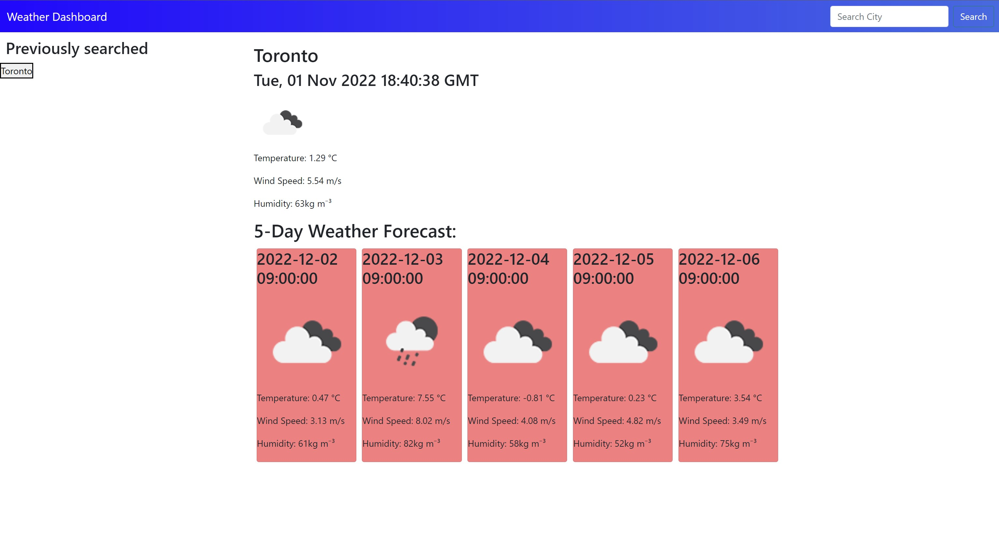

# globalWeatherTracker

## Description

This is a webpage where you can search a city and it will show you the weather for that city currently and every 24 hours relative to the time you searched. Using a free open weather API i take what the user searches and sort through the data to show the weather every 24 hours. I would've loved to use a second api that takes city names and changes them into coords and then use the answer to use one of the other api's that use the lat, lon to search the weather and use a daily weather api

## Installation

You can download the repo here:

https://github.com/jarrettbutler/globalWeatherTracker

You can visit the website here:

https://jarrettbutler.github.io/globalWeatherTracker/

snd heres a screen shot

</img>

## Usage

When you search somewhere the weather will show up so that you know what the weather will look like 1every 24 hours. When you click on a button it will bring up the data for what you searched. One bug I have is that when you search or click on the buttons the old values will dissapear as well as the buttons won't stay if you reload the page

## License

Please see the github repo for licensing

## Tests

Search something in the search bar or click on a button you'll see the values show up